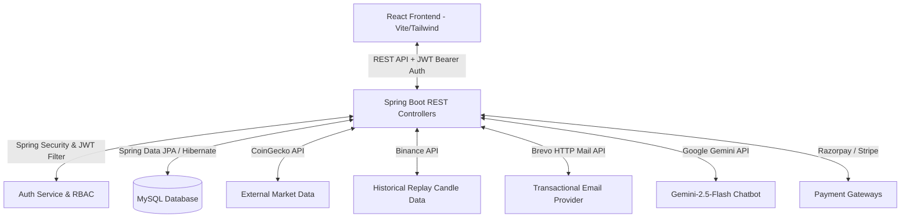

# 🚀 CryptoVault — Full Stack Cryptocurrency Trading & Backtesting Sandbox Platform

CryptoVault is a production-oriented, full-stack fintech platform designed to enable secure cryptocurrency trading, simulated historical market replay backtesting, digital wallet and portfolio management, payment processing, AI-powered trading assistance, and multi-user administrative dashboards. 

Engineered with secure coding practices matching OWASP Top 10 recommendations, the system consists of a robust **Java Spring Boot backend** and a premium, responsive **React (Vite) frontend**.

---

## 🏗️ Architecture & System Design

CryptoVault is built on a decoupled client-server architecture:



### Key Architectural Concepts
*   **Authentication Protocol:** JWT stateless authentication. Role claims (`ROLE_USER` and `ROLE_ADMIN`) are validated on each request.
*   **Data Synchronization:** CoinGecko feeds live token valuations to the user interface, while local transactions and operations are stored in MySQL.
*   **Fail-Safe Scheduling:** A simulated playback scheduler drives the historical market replay charts, switching details seamlessly into an isolated, database-backed virtual environment.

---

## ⚙️ Technology Stack

### Backend
*   **Core Engine:** Java 17, Spring Boot 3.2, Maven
*   **Security:** Spring Security, JWT (Json Web Tokens), BCrypt Password Hashing, Role-Based Access Control (RBAC)
*   **Data Persistence:** Spring Data JPA, Hibernate ORM, MySQL Connector
*   **Communications:** Brevo HTTP Mail API integration, Jakarta Mail / Angus Mail
*   **Dependencies & Tools:** Lombok, Jakarta Bean Validation, JSON Java library (`org.json`)

### Frontend
*   **Framework & Build:** React 19, Vite, React Router v7
*   **Aesthetics & Motion:** Tailwind CSS v3, Framer Motion (smooth page transitions, animations)
*   **Charting & Data Viz:** Lightweight Charts (trading charts), Recharts (equity curve plotting)
*   **Icons & Fonts:** Lucide React icons, Hanken Grotesk, Inter, and JetBrains Mono fonts

---

## 🔥 Deep Dive: Core Features & Working Principles

### 1. Interactive Market Replay Mode (Backtesting Sandbox)
An advanced trading sandbox that isolates simulated trading sessions from the live production wallet.

#### ⚙️ How it Works under the Hood:
1.  **Session Creation & Storage:** When a user initiates a replay session, the backend persists a new `ReplaySession` instance with configuration parameters (symbol, interval, virtual starting balance, and time range). It initializes an isolated `ReplayWallet` and `ReplayPortfolio` linked strictly to this session.
2.  **Binance Historical Seeding:** The system connects to the public Binance API `klines` endpoint to pull up to 1,000 candle elements starting from the selected timestamp.
    *   *Fallback Generator:* If the external API fails (rate limits, network issues, or request for an unsupported token), a synthetic candle generator (`generateSyntheticCandles`) kicks in. It applies a random-walk simulation adjusted by realistic historical price scales for each asset class (e.g. starting around $60,000 for BTC, $3,000 for ETH, etc.) to guarantee continuous playback.
3.  **Playback Control & Scheduler:** Driven by client-side event loops, ticks advance the `currentTime` pointer of the active session. This determines which candles are visible to the UI chart. Users can Play, Pause, speed up (`0.5x`, `1x`, `2x`, `5x`), or step through candles manually.
4.  **Isolated Virtual Order Engine:**
    *   When a user clicks BUY, the engine validates that the session's quote currency (e.g., USDT) wallet has sufficient funds. It deducts the `totalCost` (`quantity * price`) and recalculates the average base price using the weighted formula:
        $$\text{newAvg} = \frac{(\text{currentQty} \times \text{avgPrice}) + \text{totalCost}}{\text{currentQty} + \text{quantity}}$$
    *   When selling, the engine verifies base currency holdings, credits the quote currency, and logs the closed transaction's Profit and Loss (PnL):
        $$\text{PnL} = \text{totalCost} - (\text{quantity} \times \text{avgPrice})$$
5.  **Backtest Analytics Dashboard:**
    *   Calculates key metrics including **Win/Loss Rates**, **Profit Factor** ($\frac{\text{totalProfit}}{\text{totalLoss}}$), **Average Risk-to-Reward Ratio**, and **ROI**.
    *   **Maximum Drawdown** is computed by tracking peak equity values sequentially:
        $$\text{Drawdown} = \frac{\text{Peak Equity} - \text{Running Equity}}{\text{Peak Equity}} \times 100$$
    *   Generates an equity curve array mapping dates to active portfolio values, rendered as an interactive Recharts area chart.

---

### 2. Premium Security, Session Control & Multi-Device Audits
Designed with defense-in-depth protocols to protect user profiles and financial assets.

#### ⚙️ How it Works under the Hood:
1.  **Stateful Session Tracking:** Standard JWTs are stateless, but CryptoVault implements a hybrid architecture. The backend records each login device configuration in a `UserSession` table (logging device type, IP address, operating system, and login location).
2.  **Remote Session Revocation:** Users can audit active sessions from the Security tab. Clicking the revoke action removes that session from the database. The security filter (`JwtTokenValidator.java`) cross-references incoming JWT session claims against database records; if a session is revoked, the request is immediately rejected.
3.  **2FA OTP Security Flow:** When sensitive operations occur (changing password, deleting account, setting transfer PIN), a one-time OTP is generated, hashed, and dispatched via email.
    *   *Replay Prevention:* To prevent multiple submissions, the OTP is deleted from the database immediately upon the first verification attempt.
    *   *OTP Purging:* Before dispatching a new OTP, the system purges any existing code records for that user, solving reliability bugs where old codes blocked new delivery.
4.  **Structural Document Validators (India KYC):**
    The backend uses custom Jakarta annotation constraints to validate critical Indian financial formats before saving records to database:
    *   **PAN Validator:** Matches the formatting regex: `^[A-Z]{5}[0-9]{4}[A-Z]{1}$`.
    *   **IFSC Code Validator:** Verifies bank branch formatting: `^[A-Z]{4}0[A-Z0-9]{6}$`.
    *   **UPI Address Validator:** Validates virtual payment address strings: `^[a-zA-Z0-9._-]{2,256}@[a-zA-Z]{2,64}$`.
    *   **Aadhaar UIDAI Verhoeff Checksum:** Validation uses the mathematical **Verhoeff algorithm** (a base-10 dihedral group $D_5$ check) to prevent typos. It runs input digits through permutation matrices (`p`) and multiplication tables (`d`) to verify that the final checksum equals `0`.

---

### 3. Digital Wallets & Payment Processing
Manages fiat deposits, wallet balances, coin exchanges, and withdrawals.

#### ⚙️ How it Works under the Hood:
1.  **Gateway Integration:** Deposits are supported via Stripe (Credit Card) and Razorpay (UPI, Netbanking, Cards).
2.  **Razorpay Duplicate Prevention:**
    *   When a user completes a payment, Razorpay sends a webhook or callback with the transaction ID.
    *   The backend verifies the captured status. Crucially, the system locks the `PaymentOrder` record, updates its state to `SUCCESS`, and executes an immediate JPA `save()` to prevent double-deposit replay attacks.
3.  **Strict Balance Validation:**
    Before executing asset purchases or wallet-to-wallet transfers, the system enforces pre-allocation validation checks. If a user's wallet balance is insufficient, the system throws an exception immediately *before* executing database mutations.
4.  **Transactional Integrity:**
    All wallet mutation services are annotated with Spring's `@Transactional(rollbackFor = Exception.class)`. This guarantees that if any step of a transfer or trade fails, the database automatically rolls back, preventing orphaned credits or debits.

---

### 4. Centralized Notification & Communication Hub
An event-driven messaging service coordinating in-app updates and transactional emails.

#### ⚙️ How it Works under the Hood:
1.  **Dual-Party Messaging:** For actions involving two users (e.g., wallet-to-wallet transfers), the system dispatches distinct notifications to both the sender (debit log) and the recipient (credit log).
2.  **Brevo HTTP API Integration:**
    *   Traditional SMTP triggers port blocks (e.g., port 587) on server environments like Railway.
    *   CryptoVault overrides standard JavaMailSender behaviors to route transactional emails via Brevo's HTTP API. This encapsulates payload elements inside a JSON structure and sends them over HTTPS (`POST https://api.brevo.com/v3/smtp/email`), ensuring delivery.
3.  **HTML Templating Engine:** Transactional messages are injected into HTML templates containing responsive styles and action links.

---

### 5. Contextual Gemini AI Assistant
Provides real-time AI assistance for trading queries directly from the workspace.

#### ⚙️ How it Works under the Hood:
1.  **API Integration:** Queries are routed to Google's Gemini API (`gemini-2.5-flash`).
2.  **JSON Payload Hardening:** To block JSON injection attacks from user inputs, prompts are sanitized and enclosed using `JSONObject.quote()` before being dispatched.
3.  **Plan-Based Rate Limiting:**
    *   Free users are capped at 10 AI queries per day.
    *   Premium users have unlimited assistant access. Limits are enforced at the API layer based on the user's `Subscription` status.

---

### 6. Subscription & Membership Systems
Enables users to unlock premium features and access lower fee tiers.

#### ⚙️ How it Works under the Hood:
1.  **Upgrade Path:** Users can purchase subscription tiers (Free, Gold, Platinum, VIP) using either linked payment gateways or directly deducting from their existing wallet balance.
2.  **Dynamic UI Adaptation:** The frontend parses subscription claims from the decrypted JWT payload and dynamically hides lower-tier upgrade prompts.

---

### 7. Unified Admin Dashboard
Gives platform administrators control over transactions, users, and compliance.

#### ⚙️ How it Works under the Hood:
1.  **Endpoint Gating:** Admin endpoints are secured using Spring Security role checks (`hasRole('ADMIN')`). JWT claims are verified at the server gate.
2.  **Compliance Auditing:** Admins can view submitted KYC documents and approve/deny identities.
3.  **Withdrawal Processing:**
    *   Approved withdrawals mark the request as `SUCCESS` and schedule the payout.
    *   Denied withdrawals trigger an automatic refund that returns the locked withdrawal amount back to the user's wallet.

---

## 🔐 Security Audits & Code Integrity Patches

A chronological look at critical vulnerability fixes implemented in this project:

1.  **RBAC and Admin Endpoints Hardening:** Fixed security configurations where Spring Security roles were missing from JWT claims. Blocked open `/api/admin/**` endpoints, ensuring access is strictly restricted to `ROLE_ADMIN` users.
2.  **Withdrawal Refund Correctness:** Replaced faulty controller logic that routed rejected withdrawal funds to the admin's wallet, ensuring refunds are returned to the correct user.
3.  **Order Balance Checks:** Corrected insufficient-funds validation logic that checked the balance *after* subtraction, blocking unauthorized purchases.
4.  **Razorpay Duplicate Prevention:** Fixed an order state issue by invoking explicit JPA `save()` updates on successful checkout callbacks, preventing multiple credits from a single transaction ID.
5.  **Checked Exceptions Rollbacks:** Configured transaction boundaries to roll back on checked exceptions, eliminating orphaned database rows.
6.  **OTP Replay Prevention:** Configured the authentication engine to delete verification code records immediately upon validation.
7.  **OTP Re-Send Reliability:** Replaced stale code reuse in verification routes by purging existing records before generating and sending a new OTP.
8.  **Snake_Case Response Normalization:** Resolved camelCase vs snake_case data model formatting differences by applying a custom frontend normalization helper (`normalizeCoin`), fixing blank charts and coin data pages.
9.  **User Verification Status Inconsistency:** Fixed an issue where verified users (e.g., registered/authenticated via Google OAuth2 or manually verified via OTP) retained their status field as `PENDING`. Ensured that `verifyUser`, Google OAuth handlers, and startup admin seed scripts correctly sync both `isVerified = true` and `status = UserStatus.VERIFIED` fields.

---

## ⚙️ Getting Started & Setup

### Prerequisites
- Java Development Kit (JDK) 17
- Node.js (v18 or above) & npm
- MySQL Server

### 1. Database Configuration
1. Create a MySQL database named `crypto_trading_platform`.
2. Open `Backend/src/main/resources/application.properties` and verify details. You can override properties using local environment variables:
   - `SPRING_DATASOURCE_URL` (Default: `jdbc:mysql://localhost:3306/crypto_trading_platform`)
   - `SPRING_DATASOURCE_USERNAME` (Default: `root`)
   - `SPRING_DATASOURCE_PASSWORD` (Default: `admin` or your DB password)

### 2. External API Configuration
Configure the following API keys in `application.properties` or set them as environment variables:
- `GEMINI_API_KEY`: Google Gemini API Key
- `RAZORPAY_API_KEY` & `RAZORPAY_API_SECRET`: Razorpay Gateway credentials
- `STRIPE_API_KEY`: Stripe payment API key
- `COINGECKO_API_KEY`: CoinGecko market API key
- `MAIL_USERNAME` & `MAIL_PASSWORD`: SMTP credentials (if not utilizing the Brevo integration)
- `FRONTEND_URL`: URL of the running frontend (Default: `http://localhost:5173`)

### 3. Running the Backend
1. Open a terminal and navigate to the backend folder:
   ```bash
   cd Backend
   ```
2. Build and run the Spring Boot server:
   ```bash
   ./mvnw spring-boot:run
   ```
   The API server will launch at **http://localhost:5454**.

### 4. Running the Frontend
1. Open a new terminal and navigate to the frontend folder:
   ```bash
   cd f2
   ```
2. Copy the sample environment file and check the API URL:
   ```bash
   cp .env.example .env
   ```
3. Install dependencies and start the Vite development server:
   ```bash
   npm install
   ```
   ```bash
   npm run dev
   ```
   The frontend will launch at **http://localhost:5173**.

---

## 📄 License & Demonstration
This project is licensed under the MIT License - see the `LICENSE` file for details. Built to demonstrate advanced full-stack software engineering practices, secure finance transaction architectures, and interactive client workflows.
