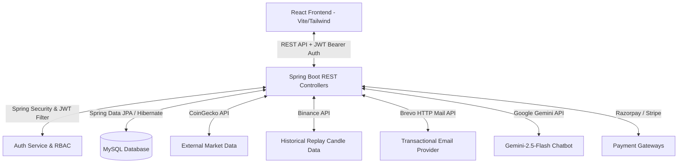

# 🚀 CryptoVault — Full Stack Cryptocurrency Trading & Backtesting Sandbox Platform

CryptoVault is a production-oriented, full-stack fintech platform designed to enable secure cryptocurrency trading, simulated historical market replay backtesting, digital wallet and portfolio management, payment processing, AI-powered trading assistance, and multi-user administrative dashboards. 

Engineered with secure coding practices matching OWASP Top 10 recommendations, the system consists of a robust **Java Spring Boot backend** and a premium, responsive **React (Vite) frontend**.

---

## 🏗️ Architecture & System Design

CryptoVault is designed on a decoupled client-server architecture:



- **Authentication Protocol:** JWT stateless authentication. Role claims (`ROLE_USER` and `ROLE_ADMIN`) are validated on each request.
- **Data Synchronization:** CoinGecko feeds live token valuations to the user interface, while local transactions and operations are stored in MySQL.
- **Fail-Safe Scheduling:** A simulated playback scheduler drives the historical market replay charts, switching details seamlessly into an isolated, database-backed virtual environment.

---

## ⚙️ Technology Stack

### Backend
- **Core Engine:** Java 17, Spring Boot 3.2, Maven
- **Security:** Spring Security, JWT (Json Web Tokens), BCrypt Password Hashing, Role-Based Access Control (RBAC)
- **Data Persistence:** Spring Data JPA, Hibernate ORM, MySQL Connector
- **Communications:** Brevo HTTP Mail API integration, Jakarta Mail / Angus Mail
- **Dependencies & Tools:** Lombok, Jakarta Bean Validation, JSON Java library (`org.json`)

### Frontend
- **Framework & Build:** React 19, Vite, React Router v7
- **Aesthetics & Motion:** Tailwind CSS v3, Framer Motion (smooth page transitions, animations)
- **Charting & Data Viz:** Lightweight Charts (trading charts), Recharts (equity curve plotting)
- **Icons & Fonts:** Lucide React icons, Space Grotesk, Inter, and JetBrains Mono fonts

---

## 🔥 Core Features & Implementation Details

### 1. Interactive Market Replay Mode (Backtesting Sandbox)
An advanced trading sandbox that isolates simulated trading sessions from the live production wallet:
*   **Flexible Setup:** Launch sessions for any supported trading pair (e.g., BTC/USDT, ETH/USDT) across multiple timeframes (`1m`, `5m`, `15m`, `1h`, `1d`) with custom virtual starting balances.
*   **Player Controls:** Play, Pause, and Resume controls driven by a reactive scheduler. Replay speeds can be adjusted dynamically (`0.5x`, `1x`, `2x`, `5x`), or users can step through candles manually.
*   **Isolated Order Engine:** Place simulated MARKET orders. The engine tracks holdings, updates virtual wallets, calculates base/quote constraints, and maintains a distinct order ledger.
*   **Binance Seed Fallback:** Automatically fetches up to 1,000 candles from the public Binance API. If rate limits are reached or an unsupported coin is requested, a synthetic candle generator takes over to ensure chart continuity.
*   **Real-time Analytics:** Computes performance metrics on the fly, including Win Rate, Return on Investment (ROI), average Risk-to-Reward ratio, and plots an interactive equity curve showing Maximum Drawdown.
*   **Data Persistence:** Sessions, wallets, simulated orders, and playback time-states are fully persisted in the MySQL database so users can resume backtests anytime.

### 2. Premium Security tab & Account Integrity
Designed with defense-in-depth protocols to protect user profiles and financial assets:
*   **Two-Factor Authentication (2FA):** Secure verification via email OTP during sensitive activities.
*   **Active Device Tracking:** Displays a structured list of logged-in sessions with device identifiers and a Security Help & Tips guideline block.
*   **Secure Pin Operations:** Withdrawal and asset transfer operations are protected by a secure Transfer PIN flow, which requires email OTP confirmation to edit or set.
*   **Account Deletion:** Users can permanently delete their accounts, which requires entering a fresh OTP sent to their verified email address.
*   **Self-Healing Admin Seeding:** Generates default administrator accounts on startup (`admin@vishal.com`) while automatically bypassing verification screens for admin roles.

### 3. Unified Admin Panel
A platform control center accessible strictly to users possessing the `ROLE_ADMIN` authority:
*   **Statistics Reporting:** Tracks aggregate metrics including total registered users, transaction quantities, processed orders, active wallets, and pending withdrawal amounts.
*   **Master Lists:** Access lists of all registered users, wallets, global order histories, and platform-wide notification logs.
*   **Withdrawal Approvals:** Approve or decline user withdrawal requests. Funds from rejected withdrawals are safely refunded back to the original request owner's wallet.

### 4. Centralized Notification & Communication Hub
An event-driven messaging service coordinating in-app updates and transactional emails:
*   **Centralized Dispatch:** Triggers in-app cards and emails for key events: registration, instant deposits, payment completions, withdrawal actions, wallet transfers, and order placements.
*   **Dual-Party Logging:** On wallet-to-wallet transfers, both the sender and the recipient receive individual logs and notifications.
*   **Brevo Email API Integration:** Migrated from standard SMTP to the Brevo HTTP API to bypass email-sending port blocks on cloud hosting platforms (e.g. Railway).
*   **Branded Templates:** Emails feature customized HTML styles, asynchronous delivery queues, and transparent brand styling.

### 5. Wallets, Orders, & Payment Gateways
*   **Instant & Gateways Deposits:** Support for fast developer deposits and official checkouts powered by Razorpay (and Stripe). Payment updates trigger backend state synchronization, preventing duplicate credits.
*   **Limit Enforcement:** Transaction limitations are applied to payment requests (e.g. Razorpay capped at 200,000 INR).
*   **Coin-to-Coin Exchange:** Trade one digital asset directly for another with backend verification of quantity constraints.
*   **Transaction Rollbacks:** Financial and order methods are wrapped in `@Transactional(rollbackOn = Exception.class)` block annotations to guarantee database consistency under failed operations.

### 6. Contextual Gemini AI Assistant
*   **Chatbot Integration:** An interactive chat bubble powered by Google Gemini API (`gemini-2.5-flash`).
*   **Request Hardening:** Request payloads are escaped using `JSONObject.quote()` to prevent JSON-injection attacks. Includes null-safety checks and rate-limiting blocks.

### 7. Subscription & Membership Systems
*   **Billing Gating:** Restricts premium feature access based on membership tiers purchased via Razorpay or using existing wallet balances.
*   **UI Intelligence:** Dynamically hides upgrade options for membership levels below the user's currently active status.

---

## 🔐 Security Audits & Code Integrity Patches

A chronological look at critical vulnerability fixes implemented in this project:

1.  **RBAC and Admin Endpoints Hardening:** Fixed security configurations where Spring Security roles were missing from JWT claims. Blocked open `/api/admin/**` endpoints, ensuring access is strictly restricted to `ROLE_ADMIN` users.
2.  **Withdrawal Refund Correctness:** Replaced faulty controller logic that routed rejected withdrawal funds to the admin's wallet, ensuring refunds are returned to the correct user.
3.  **Order Balance Checks:** Corrected insufficient-funds validation logic that checked the balance *after* subtraction, blocking unauthorized purchases.
4.  **Razorpay Duplicate Prevention:** Fixed an order state issue by invoking explicit JPA `save()` updates on successful checkout callbacks, preventing multiple credits from a single transaction ID.
5.  **Checked Exceptions Rollbacks:** Configured transaction boundaries to roll back on checked exceptions, eliminating orphaned database rows.
6.  **OTP Replay Prevention:** Configured the authentication engine to delete verification code records immediately upon validation.
7.  **OTP Re-Send Reliability:** Replaced stale code reuse in verification routes by purging existing records before generating and sending a new OTP.
8.  **Snake_Case Response Normalization:** Resolved camelCase vs snake_case data model formatting differences by applying a custom frontend normalization helper (`normalizeCoin`), fixing blank charts and coin data pages.
9.  **User Verification Status Inconsistency:** Fixed an issue where verified users (e.g., registered/authenticated via Google OAuth2 or manually verified via OTP) retained their status field as `PENDING`. Ensured that `verifyUser`, Google OAuth handlers, and startup admin seed scripts correctly sync both `isVerified = true` and `status = UserStatus.VERIFIED` fields.

---

## ⚙️ Getting Started & Setup

### Prerequisites
- Java Development Kit (JDK) 17
- Node.js (v18 or above) & npm
- MySQL Server

### 1. Database Configuration
1. Create a MySQL database named `crypto_trading_platform`.
2. Open `Backend/src/main/resources/application.properties` and verify details. You can override properties using local environment variables:
   - `SPRING_DATASOURCE_URL` (Default: `jdbc:mysql://localhost:3306/crypto_trading_platform`)
   - `SPRING_DATASOURCE_USERNAME` (Default: `root`)
   - `SPRING_DATASOURCE_PASSWORD` (Default: `admin` or your DB password)

### 2. External API Configuration
Configure the following API keys in `application.properties` or set them as environment variables:
- `GEMINI_API_KEY`: Google Gemini API Key
- `RAZORPAY_API_KEY` & `RAZORPAY_API_SECRET`: Razorpay Gateway credentials
- `STRIPE_API_KEY`: Stripe payment API key
- `COINGECKO_API_KEY`: CoinGecko market API key
- `MAIL_USERNAME` & `MAIL_PASSWORD`: SMTP credentials (if not utilizing the Brevo integration)
- `FRONTEND_URL`: URL of the running frontend (Default: `http://localhost:5173`)

### 3. Running the Backend
1. Open a terminal and navigate to the backend folder:
   ```bash
   cd Backend
   ```
2. Build and run the Spring Boot server:
   ```bash
   ./mvnw spring-boot:run
   ```
   The API server will launch at **http://localhost:5454**.

### 4. Running the Frontend
1. Open a new terminal and navigate to the frontend folder:
   ```bash
   cd f2
   ```
2. Copy the sample environment file and check the API URL:
   ```bash
   cp .env.example .env
   ```
3. Install dependencies and start the Vite development server:
   ```bash
   npm install
   ```
   ```bash
   npm run dev
   ```
   The frontend will launch at **http://localhost:5173**.

---

## 📄 License & Demonstrate
This project is licensed under the MIT License - see the `LICENSE` file for details. Built to demonstrate advanced full-stack software engineering practices, secure finance transaction architectures, and interactive client workflows.
